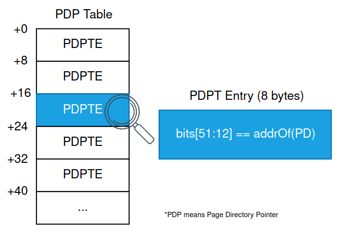

## Virtual to Physical address translation

Date: 2024-09-01

[TOC]

### Introduction

This blogpost aims to explain how to translate a 64-bit virtual memory address to physical memory address with practical demonstration. 

### Four level paging

When an userland process is executing, the CR3 register holds the physical address of a structure called PML4 Table. This table is the main element used to translate a virtual memory address in a physical memory address, so understanding what is this table is mandatory.

The PML4 Table contains elements called PML4 entries, and each entry is 8-bytes long (64 bits). Some of these bits form a (physical address) pointer to other structure called PDPT:


The PDP Table follows the same principle. Each one of its entries are known as PDPT Entry, and some of the bits of its value form a pointer to other structure called PD:



The entries in PD are called PD Entries, and some of its bits form a pointer to the final table, called Page Table (PT):


The Page Table also contain entries, called Page Table Entries, and with some bits of an entry we can finally form a phisical address that points to the effective data:


Maybe the diagram below can help you visualize the complete translation process:


**But there are some missing pieces.** I haven't effectively demonstrated yet how a virtual address can be translated to physical address. As you can see in the diagrams, each table has several entries. Which entry should we choose? 

### Parsing the Virtual Address

The target virtual address we want to translate to physical address contains all the missing pieces to perform the effective translation.

By looking into the target virtual address:
- The bits from 39 to 47 (9 bits) will be used to discover the index of PML4 entry;
- The bits from 30 to 38 (9 bits) will be used to discover the index of PDPT entry;
- The bits from 21 to 29 (9 bits) will be used to discover the index of PDT entry;
- The bits from 12 to 20 (9 bits) will be used to discover the index of Page Table entry;
- And finally, the remaining 12 bits, from 0 to 11 will be used to discover the effective physical address offset.

Let's see all these bits in a diagram to make it clear. We will use as an example the virtual address 0x5e3d30ef2169.


We can see from the image that the bits from 39 to 47 are `010111100`, which is `188` in decimal. So to locate the proper PML4 entry, we must:

1. Get the address of the PML4 Table by looking the value of CR3;
2. We know that each entry in the PML4 table has 8 bytes;
3. So the PML4 entry we are looking for is located at the address `CR3 + (188 * 8)`;

Below you can find a diagram that shows all the indexes being used to locate the proper table entries:


### Pratice

Now you can find the instructions to perform the translation manually. 

#### Running QEMU

First of all, make sure you have qemu installed. We will need `qemu-system-x86_64` to debug a Lubuntu.

Save the code below as `run-lubuntu-playground.sh`. The first time you run it you will install Lubuntu. You can select the minimal instalation.

```
#!/bin/sh

mkdir -p ./qemu-playground
cd ./qemu-playground/

mkdir -p iso
cd iso

if [ ! -f lubuntu.iso ]; then
    wget "https://cdimage.ubuntu.com/lubuntu/releases/24.04.1/release/lubuntu-24.04.1-desktop-amd64.iso" -O lubuntu.iso
    
    cd ..
    mkdir -p img
    cd img

    qemu-img create -f qcow2 lubuntudisk.img 12G

    cd ..

    qemu-system-x86_64 -M q35,smm=on,accel=kvm -m 2G -cdrom ./iso/lubuntu.iso -hda ./img/lubuntudisk.img -net none -serial file:debug.log

else
    cd ..
    qemu-system-x86_64 -s -M q35,smm=on,accel=kvm -m 2G -hda ./img/lubuntudisk.img -chardev qemu-vdagent,id=ch1,name=vdagent,clipboard=on -device virtio-serial-pci -device virtserialport,chardev=ch1,id=ch1,name=com.redhat.spice.0 -serial file:debug.log
```

The first time you run, edit the file `/etc/apt/apt.conf.d/20auto-upgrades` and set the two `Periodic` configurations to `0` in order to avoid auto update. Then run `sudo apt update && sudo apt install build-essential`, since later we will use gcc. Finally, shutdown the machine. Run the script again. It will use the already installed Lubuntu and will start qemu with `-s` parameter, which allows us to debug the system with gdb.


#### Attach GDB to QEMU

Just run `gdb` and then, inside GDB, run `target remote :1234`. It will attach in Lubuntu. Send the command `c` to continue the system execution.

#### Helper program

This sample program will help to make GDB break in the context of the right process. Create a C program like this:

```
#include <stdio.h>

int foo(){
    return 0;
}

int main(){
    printf("%p\n", foo);
    getchar();
    return foo();
}
```

Compile it with `gcc test.c -o test` and run it with `./test`. You should see the pointer to the `foo()` function. Now, with the attached GDB, insert a hardware breakpoint to the function `foo()` and continue execution:

```
hbr *0x5e3d30ef2169
c
```

When you hit enter in the VM to proceed with the `getchar()`, GDB will break before executing `foo()`.


#### Performing translation manually

We will translate the virtual address of foo() to physical address. First, let's calculate the offsets of entries for all the tables we will dereference. Run this python script:

```
foo_virtual_addr = 0x5e3d30ef2169  # change this line to specify the correct address of foo()

pml4_offset = ((foo_virtual_addr & (0b111111111 << 39)) >> 39) * 8
pdpt_offset = ((foo_virtual_addr & (0b111111111 << 30)) >> 30) * 8
pdt_offset = ((foo_virtual_addr & (0b111111111 << 21)) >> 21) * 8
pt_offset = ((foo_virtual_addr & (0b111111111 << 12)) >> 12) * 8

print('PML4 offset = {0}'.format(hex(pml4_offset)))
print('PDPT offset = {0}'.format(hex(pdpt_offset)))
print('PDT offset = {0}'.format(hex(pdt_offset)))
print('PT offset = {0}'.format(hex(pt_offset)))
print('Physical address offset: {0}'.format(hex(foo_virtual_addr & 0xFFF)))
```

Here the output was:

```
PML4 offset = 0x5e0
PDPT offset = 0x7a0
PDT offset = 0xc38
PT offset = 0x790
Physical address offset: 0x169
```

Now we get the address of PML4 Table by running `i r cr3` in GDB:
```
(gdb) i r cr3

cr3            0x327e000           [ PDBR=12926 PCID=0 ]
```

Remember, this addres in CR3 is a physical memory address. GDB by default will not be able to read from physical memory addresses.
But since we are debugging a system using qemu, we can use the command `maintenance packet Qqemu.PhyMemMode:1` in GDB to change its behaviour. So now every time we reference a memory address, GDB will understand it as a physical memory address.

```
(gdb) maintenance packet Qqemu.PhyMemMode:1

sending: Qqemu.PhyMemMode:1
received: "OK"
```

Now we start reading the PML4 entry:

```
(gdb) x/1gx 0x327e000 + 0x5e0

0x327e5e0:  0x00000000025ba067
```

For every table entry, the bits from 12 to 51 will be the address to the next table. To extract these bits we can just AND the value with 0x7fffffffff000. See the python output:

```
>>> hex(0x00000000025ba067 & 0x7fffffffff000)
'0x25ba000'
```
So 0x25ba000 is the address of the next table (PDPT). We add the proper offset and read its entry value:

```
(gdb) x/1gx 0x25ba000+0x7a0

0x25ba7a0:  0x0000000006b89067
```

We AND it with 0x7fffffffff000:

```
>>> hex(0x0000000006b89067 & 0x7fffffffff000)
'0x6b89000'
```

And now we read the entry in PD Table:

```
(gdb) x/1gx 0x6b89000+0xc38

0x6b89c38:  0x0000000005d7f067
```

Get the address to Page Table:

```
>>> hex(0x0000000005d7f067 & 0x7fffffffff000)
'0x5d7f000'
```

And read its entry:

```
(gdb) x/1gx 0x5d7f000+0x790

0x5d7f790:  0x000000002737f025
```

We AND it to get the base address to the physical address:

```
>>> hex(0x000000002737f025 & 0x7fffffffff000)
'0x2737f000'
```

This is the physical page address. To finish the full translation, we only have to add to this address the final offset:

```
>>> hex(0x2737f000 + 0x169)
'0x2737f169'
```

Now, if we read from this translated physical address and then read from the virtual address, we can see the contents are the same. Since the address points to the `foo()` function, we can disassemble some instructions to see what happens:

```
(gdb) x/10i 0x2737f169

   0x2737f169:  endbr64
   0x2737f16d:  push   %rbp
   0x2737f16e:  mov    %rsp,%rbp
   0x2737f171:  mov    $0x0,%eax
   0x2737f176:  pop    %rbp
   0x2737f177:  ret
   0x2737f178:  endbr64
   0x2737f17c:  push   %rbp
   0x2737f17d:  mov    %rsp,%rbp
   0x2737f180:  lea    -0x1e(%rip),%rax        # 0x2737f169
(gdb) maintenance packet Qqemu.PhyMemMode:0

sending: Qqemu.PhyMemMode:0
received: "OK"
(gdb) x/10i 0x5e3d30ef2169

=> 0x5e3d30ef2169:  endbr64
   0x5e3d30ef216d:  push   %rbp
   0x5e3d30ef216e:  mov    %rsp,%rbp
   0x5e3d30ef2171:  mov    $0x0,%eax
   0x5e3d30ef2176:  pop    %rbp
   0x5e3d30ef2177:  ret
   0x5e3d30ef2178:  endbr64
   0x5e3d30ef217c:  push   %rbp
   0x5e3d30ef217d:  mov    %rsp,%rbp
   0x5e3d30ef2180:  lea    -0x1e(%rip),%rax        # 0x5e3d30ef2169
```

#### Video demonstration


### Automated translation

All the steps described in this blogpost can be automated by using [PTEFinder](https://github.com/mdanilor/PTEFinder/) GDB plugin, created by a friend of mine, [mdanilor](https://mdanilor.github.io/). The tool also decodes other metadata related to the table entries, such as the supervisor bit and NX bit.


### References

1 - Intel® 64 and IA-32 Architectures Software Developer’s Manual, section 4.5 (4-level paging and 5-level paging) - June 2024
